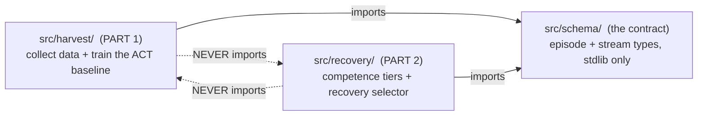
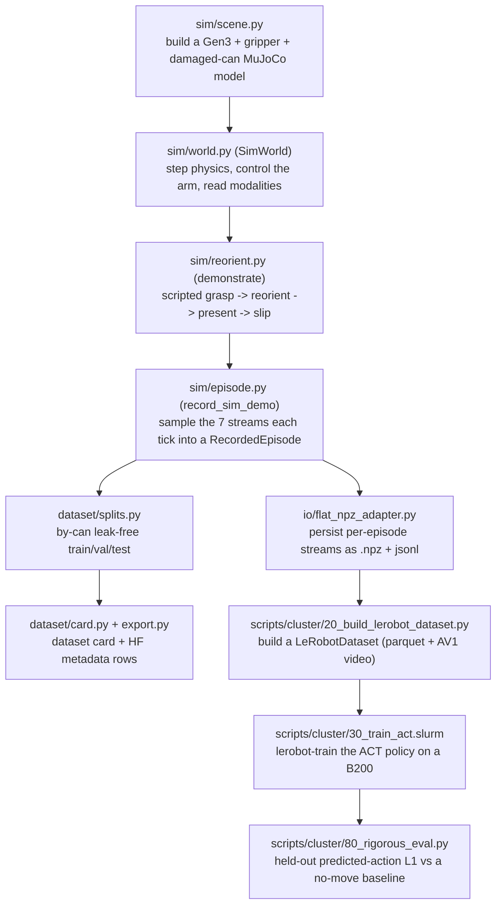

# Architecture

A guided tour of how this repo is built, written to make you fluent in it. Read it top to bottom
once, then keep it next to the code. It explains the fence (what may depend on what), the end-to-end
data flow (how a can becomes a training example), the swappable seams (where hardware drops in later),
and the parts of the simulation that are subtle. For the research framing (why the project exists, the
venues, the contribution) read `README.md`. For the live plan read `PLAN.md`.

## 1. The one idea to hold onto

Everything is organized around one rule. **Failures are the product, not the noise.** Part 1 (HARVEST)
collects a dataset and trains a policy that _deliberately_ fails on damaged cans. Part 2
(recovery-selection) consumes those failures and learns which recovery to run. So the codebase is two
tracks that share exactly one thing, a format-agnostic description of an episode. That shared thing is
the schema, and keeping the two tracks from reaching into each other is "the fence."

## 2. Two tracks, one contract (the fence)



- **`src/schema/`** is the contract. Format-agnostic episode and stream representations, dependency-light
  (stdlib only, no numpy/torch/mujoco). It is the ONLY thing the two tracks share.
- **`src/harvest/`** is Part 1. The data-collection framework plus the ACT baseline trainer. It may import
  `schema`. It may NOT import `recovery`.
- **`src/recovery/`** is Part 2. Competence tiers, the four recovery arms, the counterfactual grid, the
  recovery-regret metric, and the selector. It may import `schema`. It may NOT import `harvest` internals.

Why bother? The two tracks target different papers (Part 1 -> IEEE RA-L, Part 2 -> CoRL) and different
timelines, and Part 2 must treat the trained policy as a frozen black box. The fence makes that
separation a checkable property, not a promise. You can verify it in one command:

```bash
grep -rn "import harvest" src/recovery      # must be empty
grep -rn "import recovery" src/harvest      # must be empty
grep -rn "import torch"   src               # empty (torch is lazy-imported inside methods only)
grep -rln "import mujoco" src | grep -v src/harvest/sim   # empty (mujoco lives only in sim/)
```

Two more quarantines inside Part 1: MuJoCo appears only under `src/harvest/sim/`, and the on-disk
serialization formats live only under `src/harvest/io/`. So the physics engine and the file formats are
each swappable without touching the rest of the pipeline.

## 3. The data flow, end to end

This is the spine. Follow one can from spawn to a trained-and-scored policy.



Read it as two joined halves. The **left/local half** (scene -> world -> demo -> record -> split/card)
runs on the Mac and produces episode metadata plus, when asked, the heavy per-episode `.npz` streams.
The **right/cluster half** (npz -> LeRobot dataset -> train -> eval) runs on AICR, because the streams are
big and training needs a GPU. Generation is deterministic, so the Mac keeps only metadata and the cluster
regenerates the streams where they are consumed (see `scripts/cluster/README.md`).

One data fact matters more than any other. An episode's recorded **action at time t is the arm's joint
state at t+1** (`observation.state[t+1]`). ACT learns to predict the next joint target from the current
observation. That is why the eval's trivial baseline is "no move" (predict the current joints), and a
real policy has to beat it.

## 4. The swappable seams (how hardware drops in later)

The whole build is robot-free today and moves to a real Kinova later without rewriting the pipeline.
Each external dependency sits behind a small Protocol, with a sim implementation now and a hardware
implementation to come. These are the seams to know:

| Seam (Protocol)                | Where                | Sim implementation                                | Hardware implementation (later)                |
| ------------------------------ | -------------------- | ------------------------------------------------- | ---------------------------------------------- |
| `SensorSource`                 | `sensors/base.py`    | `MockSource`, and `SimSource` in `sim/episode.py` | `RosSource` reading real sensor topics         |
| `RobotBackend` + `SceneOracle` | `control/backend.py` | `SimWorld` (satisfies both)                       | a `RosBackend`                                 |
| `ManipulationPolicy`           | `control/policy.py`  | `ScriptedGraspPolicy`                             | teleop / a learned policy                      |
| `Trainer`                      | `policy/trainer.py`  | `StubTrainer` (a baseline floor)                  | `LeRobotACTTrainer` (real ACT, on the cluster) |
| on-disk format                 | `io/`                | `flat_npz_adapter` (streams), `_serde` (episodes) | `rosbag2_adapter` (the ROS2 boundary)          |

Note the one refactor that matters most for hardware. `control/backend.py` splits the old single
interface into **`RobotBackend`** (generic robot control and proprioception, reset/step/set_gripper/
move_pinch_to/move_pinch_pose) and **`SceneOracle`** (task ground truth the sim can answer but a real
robot cannot, can pose, upright check, grasp success, label visibility). `SimWorld` implements both. A
real `RosBackend` implements only `RobotBackend`, and the "oracle" answers come from real perception
instead. `GraspBackend` is just the composition of the two that the scripted grasp needs. One of those
real-perception answers is already built ahead of hardware: `harvest/vision/label_visibility.py` reads
label-visibility from an overhead RGB frame (numpy only), the real-camera equivalent of the sim's
segmentation-based label read, so it drops straight into a `RosBackend`'s `SceneOracle` when the camera
is up.

## 5. Module by module

The whole repo at a glance (the per-module prose below adds the "why"):

```
Harvest-Recovery/
├── README.md                       # pitch, quickstart, the file map + doc index
├── ARCHITECTURE.md                 # this file: how the software is built
├── HARVEST-VALIDITY-AUDIT.md       # red/blue validity audit of the sim dataset
├── ACT-EVAL-AUDIT.md               # red/blue audits of the ACT eval + the Option A decision
├── pyproject.toml                  # package config; pythonpath=["src"], pytest config
├── proposal/
│   ├── PROPOSAL.tex                # THE source of truth for scope + method
│   └── PROPOSAL.pdf                # compiled proposal (LaTeX build artifacts gitignored)
├── src/
│   ├── schema/                     # the CONTRACT: format-agnostic types, stdlib only (both tracks import this)
│   │   ├── episode.py              # ConditionClass, Outcome, CompetenceTier, Label, Episode, RecordedEpisode
│   │   └── streams.py              # Modality (the 7 streams), Sample, StreamSpec
│   ├── harvest/                    # PART 1: data framework + ACT baseline (imports schema, NEVER recovery)
│   │   ├── labels.py               # canonical label-name constants (shared producer <-> consumer)
│   │   ├── sensors/base.py         # SensorSource Protocol (the sensor seam)
│   │   ├── sensors/mock.py         # MockSource: deterministic synthetic source for tests
│   │   ├── recorder/recorder.py    # record_episode: sensor-agnostic sampling loop + timestamp check
│   │   ├── protocol/protocol.py    # EpisodeProtocol FSM for a real collection session (hardware/mock path)
│   │   ├── control/backend.py      # RobotBackend + SceneOracle + GraspBackend Protocols (the hardware seam)
│   │   ├── control/policy.py       # ManipulationPolicy Protocol + ScriptedGraspPolicy
│   │   ├── sim/scene.py            # build the Gen3 + gripper + damaged-can MuJoCo model
│   │   ├── sim/world.py            # SimWorld: thin control/read surface (delegates to ik/sensing/_render)
│   │   ├── sim/ik.py               # damped-least-squares IK solvers (free functions)
│   │   ├── sim/sensing.py          # force-torque / tactile / render / sample reads (free functions)
│   │   ├── sim/_render.py          # the ONE process-global renderer, closed on model change (leak fix)
│   │   ├── sim/reorient.py         # demonstrate(): grasp -> reorient -> present -> slip (THE demo generator)
│   │   ├── sim/episode.py          # record_sim_demo() + SimSource: run one demo, sample the 7 streams
│   │   ├── io/_serde.py            # episode <-> dict
│   │   ├── io/flat_npz_adapter.py  # per-episode .npz + jsonl streams (the shipped sim path)
│   │   ├── io/rosbag2_adapter.py   # rosbag2 read/write (the ROS2 / hardware boundary)
│   │   ├── dataset/splits.py       # by-can leak-free train/val/test (the can is the unit of independence)
│   │   ├── dataset/card.py         # caveat-forward dataset card
│   │   ├── dataset/export.py       # HuggingFace metadata rows
│   │   ├── dataset/competence.py   # proxy competence-tier tagging from a held-out margin
│   │   ├── dataset/generate.py     # the grid driver (conditions x orientations x poses)
│   │   ├── policy/trainer.py       # Trainer Protocol + StubTrainer (baseline floor) + LeRobotACTTrainer
│   │   ├── vision/label_visibility.py # overhead label-visibility read (numpy-only; the SceneOracle's real-camera label read)
│   │   └── annotation/             # placeholder for hardware-phase labeling tools
│   └── recovery/                   # PART 2: recovery-selection (imports schema, NEVER harvest);
│       ├── policy/base_policy.py   # BasePolicy Protocol + StubBasePolicy + FrozenACTPolicy (ACT stays frozen)
│       ├── competence/signals.py   # the 4 competence tiers + safe-set floor (Proxy/ACT competence models)
│       ├── failures/injection.py   # FailureMode catalog (5 kinds) + failure generators
│       ├── backend.py              # RecoveryBackend Protocol (the reset-and-replay seam)
│       ├── arms/                   # the four recovery arms (retry, rewind, replan, ask-human)
│       ├── grid/counterfactual.py  # counterfactual reset-and-replay grid + per-failure oracle
│       ├── metric/recovery_regret.py # ArmCost, CostWeights, recovery_regret + default weights
│       └── selector/selector.py    # cost-sensitive selector (Lagrangian human-budget)
├── scripts/cluster/                # the AICR run playbook + scripts (data is cluster-only)
│   ├── README.md                   # the cluster run playbook (order of operations)
│   ├── 00_setup_env.sh             # one-time env: Blackwell torch cu128 + lerobot + mujoco
│   ├── gen_dataset_parallel.py     # deterministic sharded episode generator (shard/assemble/local)
│   ├── 10_materialize.slurm        # regenerate the 600 streams to /scratch (all 7 modalities)
│   ├── 20_build_lerobot_dataset.py # build a LeRobotDataset from streams (--split train|heldout)
│   ├── 30_train_act.slurm          # lerobot-train the ACT policy on a B200
│   ├── 80_rigorous_eval.py         # held-out predicted-action L1 vs a no-move baseline (the valid eval)
│   └── 81_eval_diagnostic.py       # per-condition + sanity diagnostic
├── tests/                          # mirror src/, strict TDD, synthetic data only (run: MUJOCO_GL=cgl pytest)
│   ├── schema/test_schema.py           # the schema types
│   ├── harvest/test_mock_source.py     # MockSource
│   ├── harvest/test_recorder.py        # the recorder sampling loop
│   ├── harvest/test_protocol.py        # the EpisodeProtocol FSM
│   ├── harvest/test_pipeline.py        # end-to-end mock pipeline (record -> io -> read)
│   ├── harvest/test_io.py              # the io adapters round-trip
│   ├── harvest/test_splits.py          # by-can leak-free splits
│   ├── harvest/test_dataset.py         # dataset card + export
│   ├── harvest/test_competence.py      # competence-tier tagging
│   ├── harvest/test_generate.py        # the grid driver
│   ├── harvest/test_policy.py          # the Trainer interface + StubTrainer
│   ├── harvest/test_sim_world.py       # SimWorld physics/control/reads
│   ├── harvest/test_sim_condition.py   # per-condition can geometry
│   ├── harvest/test_sim_orientation.py # unknown-orientation grasp
│   ├── harvest/test_sim_episode.py     # record_sim_demo + SimSource
│   ├── harvest/test_reorient.py        # the demonstration generator
│   ├── harvest/test_label_visibility.py # the overhead label-visibility read (synthetic images + ROI)
│   └── recovery/                        # Part 2 suite: base_policy, competence, injection, backend, arms,
│                                        #   grid, metric, selector, smoke (+ the fenced sim_harness)
└── experiments/                    # committed eval result JSONs (the audit records)
```

**`src/schema/`** (the contract)

- `episode.py` -- `ConditionClass`, `Outcome`, `CompetenceTier`, `LabelProvenance`, `Label`, `Episode`,
  `RecordedEpisode`. Stdlib only.
- `streams.py` -- `Modality` (the seven streams), `Sample`, `StreamSpec`.

**`src/harvest/`** (Part 1)

- `labels.py` -- canonical label-name constants (`UPRIGHT_SUCCESS`, `GRASP_STABLE`, `LABEL_VISIBLE`,
  `LABEL_UP_COS`), imported by both the producer (`sim/episode.py`) and the consumer
  (`dataset/competence.py`) so a rename cannot silently break tier tagging.
- `sensors/` -- `SensorSource` Protocol (`base.py`) + `MockSource` (`mock.py`), the deterministic
  synthetic source for tests.
- `recorder/` -- `record_episode`, the sensor-agnostic sampling loop that pulls each modality on a clock
  and checks timestamp consistency.
- `protocol/` -- `EpisodeProtocol`, a finite-state machine for a real collection session (the
  hardware/mock path). The sim generation path does not use it, it uses `sim/episode.py` instead.
- `control/` -- the backend-agnostic control layer. `backend.py` (the `RobotBackend` / `SceneOracle` /
  `GraspBackend` Protocols) + `policy.py` (`ManipulationPolicy` Protocol + `ScriptedGraspPolicy`). No
  MuJoCo here, so a policy drives any backend.
- `sim/` -- the MuJoCo world and the demonstration generator. Detailed in section 6.
- `io/` -- serialization. `_serde.py` (episode <-> dict), `flat_npz_adapter.py` (per-episode `.npz` +
  jsonl streams, the shipped sim path), `rosbag2_adapter.py` (the ROS2/hardware boundary, tested but not
  on the sim path).
- `dataset/` -- `splits.py` (by-can leak-free split, the can is the unit of independence), `card.py`
  (caveat-forward dataset card), `export.py` (HF metadata rows), `competence.py` (proxy competence-tier
  tagging from a held-out margin), `generate.py` (the grid driver).
- `policy/` -- `trainer.py`, the torch-free `Trainer` Protocol + `StubTrainer` (condition-majority
  baseline floor) + `LeRobotACTTrainer` (real ACT, lazily imports LeRobot, runs on the cluster).
- `vision/` -- `label_visibility.py`, the overhead label-visibility read (numpy only). Reads label pixel
  coverage + a visible/legible flag (Padir's 70px bar) from an RGB frame, with a swappable `LabelSpec`
  (RGB-distance or HSV) and an optional ROI. The real-camera equivalent of the sim's segmentation label
  read, so it fills the `SceneOracle`'s label answer on hardware.
- `annotation/` -- placeholder for the hardware-phase labeling tools.

**`src/recovery/`** (Part 2, built in Milestone 2)

- `policy/base_policy.py` -- `BasePolicy` Protocol + `StubBasePolicy` (torch-free) + `FrozenACTPolicy`
  (lazy LeRobot, frozen). `competence/signals.py` -- the four tiers from latent density + ensemble
  disagreement, with the control-invariant safe set as a hard floor (`ProxyCompetenceModel` /
  `ACTCompetenceModel`). `failures/injection.py` -- the `FailureMode` catalog (5 kinds) + generators.
- `backend.py` -- the `RecoveryBackend` Protocol (the reset-and-replay seam). `arms/` -- the four arms
  (retry, rewind, replan, ask-human) as backend-agnostic behaviors. `grid/counterfactual.py` -- the
  counterfactual reset-and-replay grid + per-failure oracle. `metric/recovery_regret.py` -- `ArmCost`,
  `CostWeights`, `recovery_regret` + default weights. `selector/selector.py` -- the cost-sensitive
  selector under a Lagrangian human-budget.

## 6. The simulation, in depth (the subtle part)

The sim exists to validate the pipeline and to prototype the ACT training loop before hardware. It is a
**smoke test**, not a source of trusted numbers. Three design choices explain most of the sim code, and
one hard-won lesson explains why the sim ACT result is not evidence.

- **The weld.** MuJoCo's rigid-pad friction cannot hold a can through an in-hand reorient, so once the
  can is grasped we kinematically attach it to the hand (`Weld` in `reorient.py`), forcing the can to
  follow the pinch each step. This lets us GENERATE clean reorient demonstrations. It also means
  `grasp_stable` is a simulator-default label with no information in sim (a real tactile/physics signal
  only on hardware), which the dataset card discloses.
- **Plan-then-execute.** "Present the label up" is a whole family of arm poses, and which member is
  reachable differs per can. `reorient.py` SEARCHES that family on a hidden scratch copy of the sim (the
  recorder and viewer never see it), keeps the winning full-state snapshot, then GLIDEs the real sim to it
  as one smooth recorded motion.
- **The failure is a condition-scaled slip.** A damaged can slips in the grasp during the reorient. The
  arm rolls the can about its long axis (via IK, so the failure lives in the arm's action, not just the
  can's pose), the label rolls off the top, and the overhead read fails. Severity is a pure function of
  the visible condition (nominal barely slips, rust slips most).
- **The renderer-leak gotcha (do not undo this).** A `mujoco.Renderer` holds a GL context that Python's
  GC does not free, and creating one per episode once exhausted memory and crashed the machine.
  `sim/_render.py` keeps exactly ONE process-global renderer, closed and replaced only when the model or
  size changes. `world.render` and `reorient._overhead_px` both go through it. Keep it that way.

**Why the sim ACT result is not evidence (the lesson).** ACT trains well and fits the training cans, but
it does not generalize to held-out cans in sim. Two red/blue audits (see `ACT-EVAL-AUDIT.md`) traced this
to a structural cause: the scripted demonstration's target action is not a learnable function of what the
camera sees. The presentation pose comes from that hidden reachability search, which a 96x96 image cannot
resolve, and a simpler presentation is not reachable. So the sim validates the machinery (it runs end to
end, ACT trains, the eval is faithful) but cannot demonstrate policy generalization. The trusted ACT
baseline is the HARDWARE dataset, where demonstrations come from a human teleoperator whose pose choice
IS driven by what they see, so the demos are learnable by construction. This is why Part 1's headline
results are hardware, and the sim is a smoke test.

## 7. Testing and the dev tools

- Tests live in `tests/`, mirror `src/`, and run on synthetic data only. Strict TDD, a failing test
  before implementation. Run them with `MUJOCO_GL=cgl .venv/bin/python -m pytest` (151 passing).
- `tests/recovery/` holds the Part 2 suite (base policy, competence, injection, backend, arms, grid,
  metric, selector, and an end-to-end smoke test), plus `sim_harness.py`, the one fence-crossing adapter
  that drives a real `SimWorld` through the recovery grid (kept in `tests/`, never under `src/recovery/`).
- Gitignored dev tools at the repo root visualize the sim (never committed): `sim_present.py` (the current
  presentation), `sim_viewer.py` (a live viewer that reloads `sim_present.py` each loop), `sim_viz.py`
  (a headless filmstrip recorder), `watch_sim.sh` (the launcher). The rule (ANTIPATTERNS AP-11): every
  sim run is visualized, never judged from numbers alone.

## 8. Where everything lives (the meta-documentation index)

The canonical documents, kept current after each milestone:

| Doc                                           | What it is                                                      |
| --------------------------------------------- | --------------------------------------------------------------- |
| `README.md`                                   | Research framing, the two-track pitch, quickstart, this index   |
| `ARCHITECTURE.md`                             | This file, how the software is built                            |
| `PLAN.md`                                     | The live build plan (milestones, steps, gates)                  |
| `CLAUDE.md` / `MEMORY.md` / `ANTIPATTERNS.md` | Agentic project files (identity / live state / hard-stop rules) |
| `proposal/PROPOSAL.tex`                       | The source of truth for scope and method                        |
| `HARVEST-DESIGN-REVIEW.md`                    | Part 0 sign-off record (flags F1-F7)                            |
| `HARVEST-VALIDITY-AUDIT.md`                   | Red/blue validity audit of the sim dataset                      |
| `ACT-EVAL-AUDIT.md`                           | Red/blue audits of the ACT eval, and the Option A decision      |
| `VENUE-TIMELINE.md`                           | Target venues and dates                                         |
| `scripts/cluster/README.md`                   | The AICR run playbook                                           |
